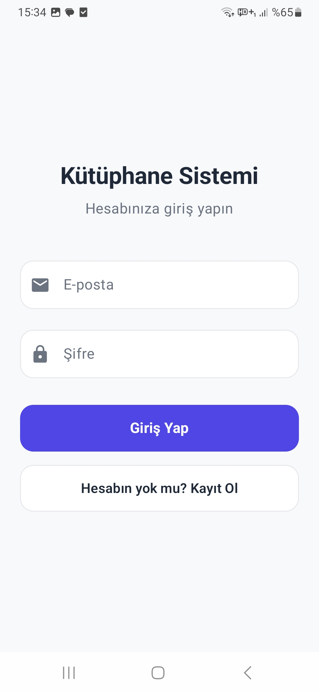
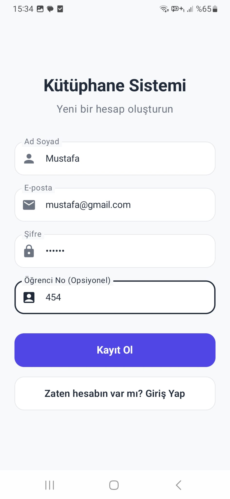
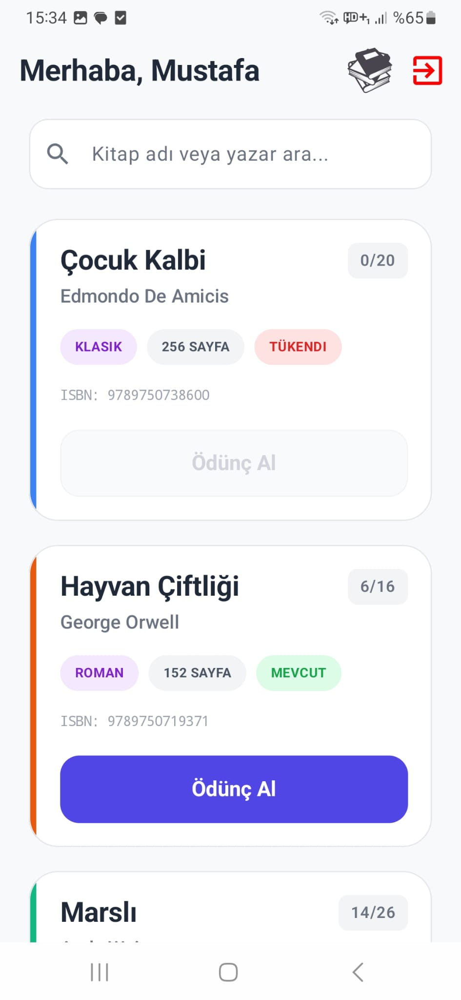
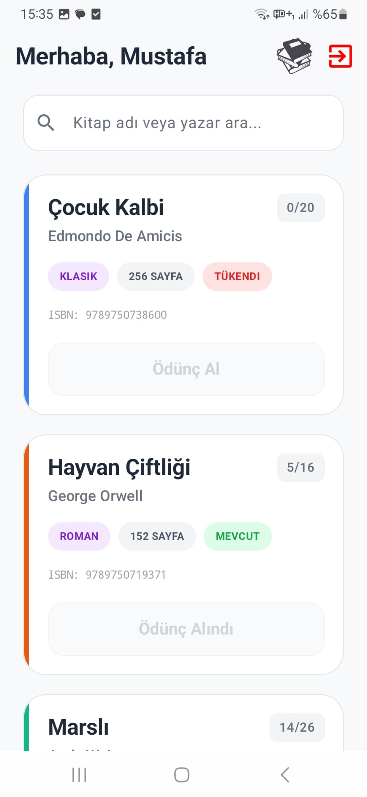
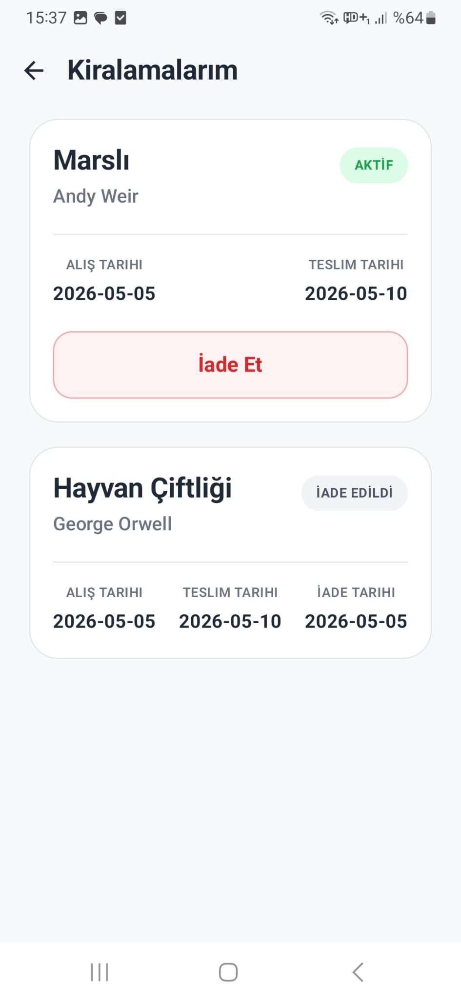

# 📚 Library App – Kütüphane Yönetim Sistemi

Modern Android teknolojileri kullanılarak geliştirilmiş bir kütüphane otomasyon uygulaması.  
Bu proje kullanıcıların kitapları görüntülemesine, aramasına, ödünç almasına ve iade etmesine olanak tanır.

## ✨ Özellikler
- Supabase Auth ile giriş ve kayıt sistemi
- Kitap listeleme ve arama
- Kitap ödünç alma sistemi
- Stok kontrolü ve stokta yok göstergesi
- Kullanıcının aktif ve geçmiş kiralamalarını görüntüleme
- Trigger destekli otomatik stok güncelleme
- Jetpack Compose ile modern kullanıcı arayüzü
- MVVM mimarisi ve Supabase entegrasyonu

---

## 🛠 Kullanılan Teknolojiler

- **Dil:** Kotlin
- **UI:** Jetpack Compose (Material 3)
- **Backend:** Supabase
- **Authentication:** Supabase Auth
- **Database:** PostgreSQL
- **Architecture:** MVVM
- **Navigation Compose:** Sayfalar arası akış yönetimi
- **Serialization:** Kotlinx Serialization
- **Kotlin Coroutines & Flow:** Asenkron veri akışları ve performanslı çalışma
- **Database Logic:** PL/pgSQL Trigger & RLS Policies

---

## 📸 Ekran Görüntüleri

| Login Sayfası | Register Sayfası |
|---|---|
|  |  |

| HomeScreen Sayfası | HomeScreen Sayfası 2 | Kiralamalar Sayfası |
|---|---|---|
|  |  |  |

---

## 💾 SQL ve Veritabanı Yapısı

Veritabanı tabloları, trigger'lar ve RLS policy kodları için aşağıdaki dosyayı inceleyebilirsiniz:

[📄 kod.sql](kod.sql)
